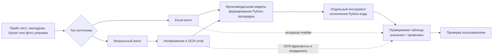
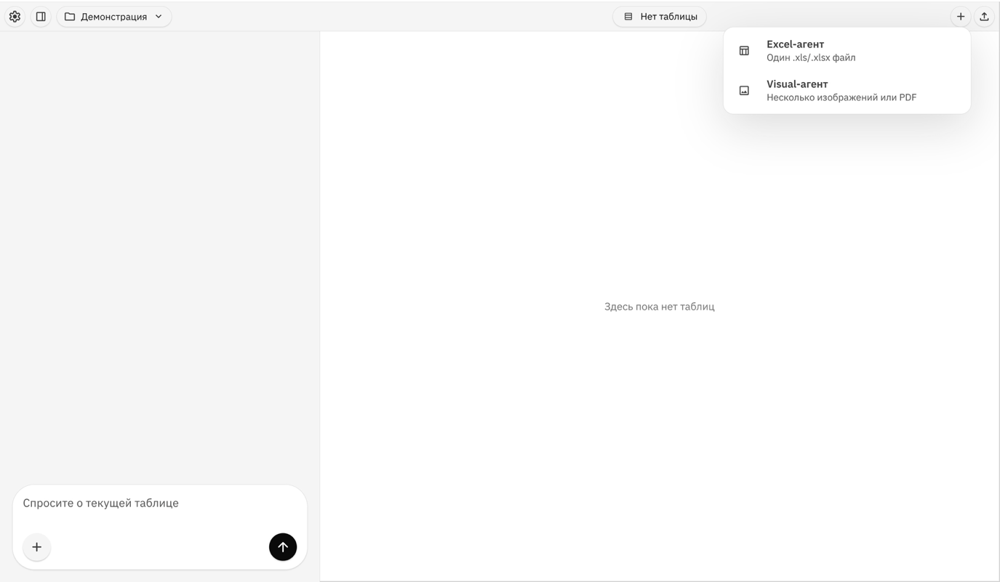

# Sidekick

**Интеллектуальная система преобразования данных из разноформатных источников в табличную форму для задач малого ритейла**

Репозиторий представляет материалы магистерской выпускной квалификационной работы:

> «Разработка интеллектуальной системы преобразования данных из разноформатных источников в табличную форму на основе мультимодальных моделей и агентного подхода (на примере задач малого ритейла)».

## О проекте

`Sidekick` - исследовательский прототип входного контура системы, которая преобразует товарную информацию из электронных таблиц и визуальных документов в проверяемую табличную форму. Решение ориентировано на задачи малого ритейла, где сведения о товарах поступают из прайс-листов, накладных, рекламных буклетов и фотографий упаковок.

В рассматриваемой части системы реализованы два специализированных агента:

- **Excel-агент** обрабатывает электронные таблицы с различной структурой строк, листов и товарных атрибутов.
- **Визуальный агент** обрабатывает изображения документов и упаковок с использованием визуального контекста и OCR-слоя.

В обоих контурах мультимодальная модель формирует процедуру обработки, адаптированную к конкретному источнику, а исполнение сформированного Python-кода выполняется отдельным инструментом. Полученный результат предназначен для последующей проверки пользователем, а не для полностью автономной записи в товароучетную систему.

## Сценарии применения

- преобразование предложений поставщиков и прайс-листов в сопоставимую табличную форму;
- подготовка данных из товарных накладных для приемки и учета;
- извлечение первичных атрибутов товара из рекламных материалов и фотографий упаковок;
- проверка происхождения заполненных значений перед их использованием в операционных процессах.

## Архитектура решения

### Проверяемость результата

Для электронных таблиц провенанс связывает результирующее значение с исходной ячейкой рабочей книги. Для визуальных источников сохраняется связь с распознанными текстовыми фрагментами и их расположением на изображении. Это позволяет отображать OCR-текст поверх исходного изображения и проверять основание для заполнения поля. Атрибуты, для которых отсутствует достаточная текстовая опора, требуют дополнительной пользовательской проверки.

## Интерфейс прототипа

В публичной версии представлен нейтральный экран выбора входного контура обработки. Скриншоты работы с исходными документами и изображениями не публикуются, поскольку они могут содержать реквизиты источников, товарные предложения и цены.

## Экспериментальная оценка

Оценка проведена на четырех классах источников общей емкостью **25 885** размеченных товарных строк и объектов.

| Класс источников | Объем данных | Основной результат |
| --- | ---: | --- |
| Excel-прайсы | 23 234 товарные строки | F1 по фактам `0.910-0.946` на сопоставимой подвыборке из 32 файлов |
| Рекламные буклеты | 2 008 товарных предложений | максимальный средний F1 по фактам `0.955` |
| Товарные накладные | 193 уникальные товарные строки, 61 документ | F1 по фактам `0.994-0.995` в трех повторных прогонах |
| Фотографии упаковок | 450 товаров/партий, 1 288 фотографий | средний F1 `0.932-0.939` в зависимости от конфигурации |

Подробные условия оценки, конфигурации моделей и таблицы метрик приведены в документе [Результаты экспериментальной оценки](docs/experiment-results.md).

## Финансовая модель

Сценарная финансовая модель проекта приведена в файле [Galieva_AI_Finmodel_v6_FINAL.xlsx](docs/financial-model/Galieva_AI_Finmodel_v6_FINAL.xlsx). Модель используется для оценки экономики стартапа, включая выручку, расходы, точку безубыточности, LTV/CAC и финансовый результат при масштабировании.

## Охрана РИД и налоговые меры

Чек-лист по охране результатов интеллектуальной деятельности и возможным налоговым мерам для проекта приведен в файле [Sidekick_RID_taxes_checklist_2026_Moscow.xlsx](docs/rid-taxes/Sidekick_RID_taxes_checklist_2026_Moscow.xlsx).

## Материалы наборов данных

В репозитории публикуются только агрегированные характеристики выборок и результаты оценки. Рабочие ноутбуки, исходные документы и изображения не включены, поскольку могут содержать товарные предложения, цены, реквизиты источников или материалы с ограничениями на распространение.

## Ограничения исследования

- Прототип рассчитан на человеко-машинный сценарий: критичные товарные атрибуты должны подтверждаться пользователем.
- Эксперименты оценивают применимость предложенного подхода и его конфигураций; прямое сравнение с промышленными системами в проведенную оценку не включено.
- Для структурно сложных Excel-файлов выявлена необходимость повышения устойчивости обработки.
- Представленная экономическая оценка носит сценарный характер и требует подтверждения в ходе пилотной эксплуатации.

## Ориентировочные требования к развертыванию прототипа

В экспериментальной конфигурации мультимодальная модель вызывается через внешний API, поэтому локальная видеокарта для демонстрационного запуска прототипа не требуется. Приведенные требования предназначены для описания предполагаемой конфигурации пилотного использования и подлежат уточнению после эксплуатационных испытаний.

| Компонент | Минимально | Рекомендуется |
| --- | --- | --- |
| Процессор | 2 ядра, от 2.0 ГГц | 4 ядра, от 2.5 ГГц |
| Оперативная память | 8 ГБ | 16 ГБ |
| Свободное место | 5 ГБ | 10 ГБ |
| Графический ускоритель | не требуется | не требуется |
| Экран | 1366 x 768 | 1920 x 1080 |
| Сеть | стабильный доступ в Интернет для обращения к API | стабильный широкополосный доступ |

## Статус

Проект подготовлен в рамках магистерской ВКР, 2026 год. Репозиторий документирует архитектуру решения, материалы экспериментальной оценки и условия применимости прототипа.
